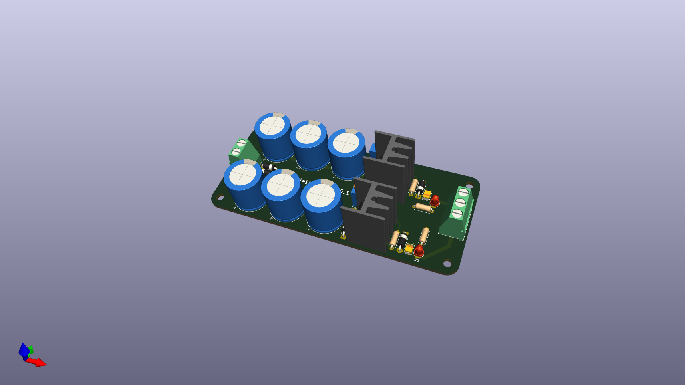

# PSU

A dual +/-12V power supply based on LM317 and LM337 adjustable voltage regulators.

This is my first PCB design. SMD capacitors were chosen due to me being unable to source
recommended bypass capacitors in THT footprints locally.

## Reference links

1. [LM317 Datasheet (TI)](https://www.ti.com/lit/ds/symlink/lm317.pdf)
2. [LM317 Datasheet (ONSemi)](https://www.onsemi.com/download/data-sheet/pdf/lm317-d.pdf)
3. [LM337 Datasheet (TI)](https://www.ti.com/lit/ds/symlink/lm337.pdf)
4. [LM337 Datasheet (ONSemi)](https://www.onsemi.com/download/data-sheet/pdf/lm337-d.pdf)
